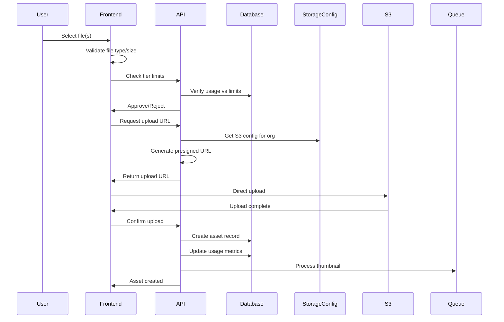

# Asset Management System

## Overview
The Asset Management System handles the storage, organization, and retrieval of digital assets including images, videos, documents, and design files. It enforces tier-based limits and supports dynamic storage configurations.

## Supported File Types

### Images
- JPEG, PNG, GIF, WebP, AVIF
- SVG (vector graphics)
- RAW formats (CR2, NEF, ARW)

### Videos
- MP4, MOV, AVI, WebM
- Maximum size: Tier-dependent (Basic: 100MB, Pro: 1GB, Enterprise: 5GB)

### Documents
- PDF
- Microsoft Office (DOCX, XLSX, PPTX)
- Google Docs formats

### Design Files
- Adobe Creative Suite (PSD, AI, INDD)
- Sketch files
- Figma exports

## System Architecture

### Storage Strategy
- **Primary Storage**: S3-compatible object storage (configurable per organization)
- **CDN Integration**: CloudFront for global delivery
- **Local Cache**: Redis for metadata
- **Database**: PostgreSQL for asset records
- **Custom S3**: Organizations can provide their own S3 buckets (tier-dependent)

## API Endpoints

```typescript
// Asset Management
GET    /api/assets                 // List assets with pagination
GET    /api/assets/:id             // Get asset details
POST   /api/assets/upload          // Upload new asset (tier limits enforced)
PUT    /api/assets/:id             // Update asset metadata
DELETE /api/assets/:id             // Delete asset
GET    /api/assets/:id/download    // Download asset
GET    /api/assets/:id/preview     // Get preview/thumbnail

// Asset Search
GET    /api/assets/search          // Search assets
GET    /api/assets/filter          // Filter by type/tags

// Asset Versions
GET    /api/assets/:id/versions    // List versions
POST   /api/assets/:id/versions    // Create new version
GET    /api/assets/:id/versions/:versionId

// Bulk Operations
POST   /api/assets/bulk/upload     // Multi-file upload
POST   /api/assets/bulk/delete     // Bulk delete
POST   /api/assets/bulk/move       // Move to different group
```

## Database Schema (Drizzle ORM)

```typescript
// assets table
export const assets = pgTable('assets', {
  id: uuid('id').defaultRandom().primaryKey(),
  organizationId: uuid('organization_id').references(() => organizations.id).notNull(),
  uploadedBy: uuid('uploaded_by').references(() => users.id).notNull(),
  
  // File information
  fileName: varchar('file_name', { length: 255 }).notNull(),
  fileType: varchar('file_type', { length: 50 }).notNull(),
  mimeType: varchar('mime_type', { length: 100 }).notNull(),
  fileSize: bigint('file_size', { mode: 'number' }).notNull(),
  
  // Storage
  storageKey: varchar('storage_key', { length: 500 }).unique().notNull(),
  thumbnailKey: varchar('thumbnail_key', { length: 500 }),
  storageProvider: varchar('storage_provider', { length: 50 }).default('default'), // 'default' or 'custom'
  
  // Metadata
  title: varchar('title', { length: 255 }).notNull(),
  description: text('description'),
  tags: jsonb('tags').default([]),
  metadata: jsonb('metadata').default({}),
  
  // Timestamps
  createdAt: timestamp('created_at').defaultNow(),
  updatedAt: timestamp('updated_at').defaultNow(),
  deletedAt: timestamp('deleted_at') // Soft delete
});

// asset_versions table
export const assetVersions = pgTable('asset_versions', {
  id: uuid('id').defaultRandom().primaryKey(),
  assetId: uuid('asset_id').references(() => assets.id).notNull(),
  versionNumber: integer('version_number').notNull(),
  uploadedBy: uuid('uploaded_by').references(() => users.id).notNull(),
  
  // Version specific data
  storageKey: varchar('storage_key', { length: 500 }).unique().notNull(),
  fileSize: bigint('file_size', { mode: 'number' }).notNull(),
  changeLog: text('change_log'),
  
  createdAt: timestamp('created_at').defaultNow()
});

// asset_permissions table
export const assetPermissions = pgTable('asset_permissions', {
  id: uuid('id').defaultRandom().primaryKey(),
  assetId: uuid('asset_id').references(() => assets.id).notNull(),
  roleId: uuid('role_id').references(() => roles.id),
  userId: uuid('user_id').references(() => users.id),
  
  canView: boolean('can_view').default(true),
  canDownload: boolean('can_download').default(true),
  canEdit: boolean('can_edit').default(false),
  canDelete: boolean('can_delete').default(false),
  
  createdAt: timestamp('created_at').defaultNow()
});
```

## Upload Process



## Tier-Based Limitations

### Storage Limits
```typescript
interface TierLimits {
  maxStorageGB: number;      // Total storage allowed
  maxFileSizeMB: number;     // Per-file size limit
  maxAssets: number;         // Total asset count
  allowCustomS3: boolean;    // Can use own S3 bucket
}

// Example tier configurations
const tierLimits = {
  basic: {
    maxStorageGB: 10,
    maxFileSizeMB: 100,
    maxAssets: 1000,
    allowCustomS3: false
  },
  pro: {
    maxStorageGB: 100,
    maxFileSizeMB: 1000,
    maxAssets: 10000,
    allowCustomS3: true
  },
  enterprise: {
    maxStorageGB: 1000,
    maxFileSizeMB: 5000,
    maxAssets: -1, // Unlimited
    allowCustomS3: true
  }
};
```

## File Processing Pipeline

### Image Processing
- Generate thumbnails (300x300, 600x600, 1200x1200)
- Create web-optimized versions
- Extract EXIF metadata
- Generate blurhash placeholder
- Convert to modern formats (WebP, AVIF) for supported browsers

### Video Processing
- Extract video thumbnail at multiple timestamps
- Generate preview clips (10s, 30s)
- Extract duration, resolution, codec info
- Transcode to web formats (tier-dependent)

### Document Processing
- Generate preview images (first page, key pages)
- Extract text for search indexing
- Parse metadata (author, created date, etc.)

## Search & Filtering

### Search Capabilities
- Full-text search on title, description
- Tag-based filtering
- File type filtering
- Date range filtering
- Size range filtering
- User/uploader filtering
- Organization-wide search (super admin only)

### Search Index
```typescript
// Indexed fields for performance
- assets.title (GIN index for full-text)
- assets.description (GIN index for full-text)
- assets.tags (GIN index for JSONB)
- assets.file_type (BTREE index)
- assets.created_at (BTREE index)
- assets.organization_id (BTREE index)
- assets.file_size (BTREE index for range queries)
```

## Performance Optimization

### Caching Strategy
- Redis cache for asset metadata (5-minute TTL)
- CDN caching for files (1-year for immutable assets)
- Browser caching headers
- Lazy loading for thumbnails
- Prefetch commonly accessed assets

### Upload Optimization
- Chunked uploads for large files
- Resume capability for interrupted uploads
- Progress tracking with WebSocket updates
- Parallel processing for bulk uploads
- Queue system for heavy processing

## Security Measures

### Access Control
- Organization-based isolation
- Role-based permissions
- Signed URLs for downloads (15-minute expiry)
- IP-based restrictions (enterprise tier)
- Watermarking support (enterprise tier)

### File Validation
- MIME type verification
- File signature checking (magic bytes)
- Virus scanning integration (ClamAV)
- Size limits enforcement
- Filename sanitization

## Storage Configuration

### Dynamic S3 Configuration
```typescript
// storage_configs table
export const storageConfigs = pgTable('storage_configs', {
  id: uuid('id').defaultRandom().primaryKey(),
  organizationId: uuid('organization_id').references(() => organizations.id).unique().notNull(),
  
  provider: varchar('provider', { length: 50 }).notNull(), // 'aws', 'gcs', 'azure'
  bucketName: varchar('bucket_name', { length: 255 }),
  region: varchar('region', { length: 50 }),
  accessKeyId: varchar('access_key_id', { length: 255 }), // Encrypted
  secretAccessKey: text('secret_access_key'), // Encrypted
  customDomain: varchar('custom_domain', { length: 255 }),
  
  isActive: boolean('is_active').default(true),
  createdAt: timestamp('created_at').defaultNow(),
  updatedAt: timestamp('updated_at').defaultNow()
});
```

## Monitoring & Analytics

### Metrics Tracked
- Upload success/failure rates by organization
- Download frequency per asset
- Storage usage per organization
- Popular assets and search terms
- Processing times and queue lengths
- Bandwidth usage (for billing)

### Usage Enforcement
```typescript
// Before any upload/operation
async function checkTierLimits(orgId: string, operation: 'upload' | 'create') {
  const usage = await getOrganizationUsage(orgId);
  const tier = await getOrganizationTier(orgId);
  const limits = tierLimits[tier];
  
  if (operation === 'upload') {
    if (usage.totalAssets >= limits.maxAssets) {
      throw new TierLimitError('Asset count limit reached');
    }
    if (usage.storageUsedGB >= limits.maxStorageGB) {
      throw new TierLimitError('Storage limit reached');
    }
  }
  
  return { usage, limits, remaining: calculateRemaining(usage, limits) };
}
```

### Alerts
- Storage quota warnings (80%, 90%, 100%)
- Failed upload patterns
- Unusual access patterns
- Processing failures
- Bandwidth overage warnings