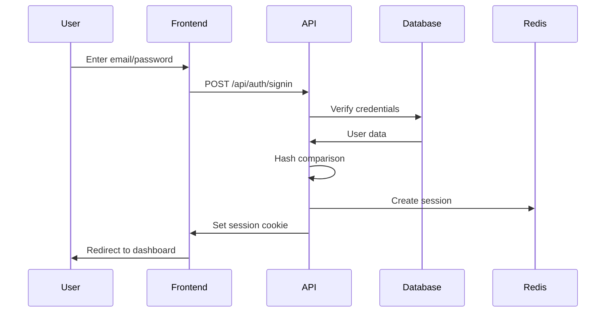
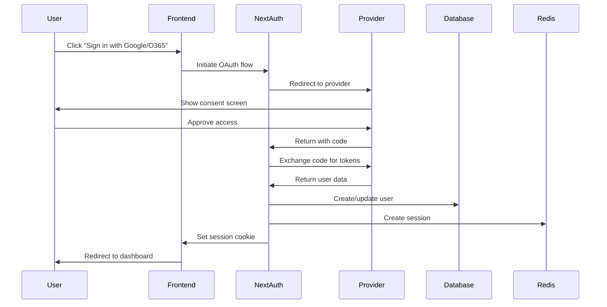

# Authentication & Authorization System

## Overview
The Authentication & Authorization system provides secure access control for the Brand Portal, supporting both traditional email/password authentication and SSO integration with role-based permissions. The system implements dual authentication strategies for internal app users and external API consumers.

## Components

### 1. Internal App Authentication (tRPC)
- **Technology**: Auth.js (NextAuth v5)
- **Purpose**: Frontend application user authentication
- **Communication**: tRPC procedures with session-based auth
- **Providers**: 
  - Credentials (email/password)
  - Google OAuth
  - Microsoft (Office 365)
- **Session Storage**: Redis with secure session tokens
- **Middleware**: tRPC procedure-level authentication and authorization

### 2. External API Authentication (REST)
- **Technology**: API Key-based authentication
- **Purpose**: Third-party integrations and external access
- **Authentication**: Bearer token with API keys
- **Rate Limiting**: Per-key request limits
- **Scope Control**: Granular permissions per API key

### 3. Authorization Service
- **RBAC Model**: Role-Based Access Control
- **Permission Levels**: Organization, Role, User
- **Middleware**: Request-level permission checks

## User Roles

### Super Admin (Platform Level)
- Cross-organization access
- Tier management
- Platform configuration
- Usage monitoring
- Organization creation/deletion
- Impersonate organization users

### Admin (Organization Level)
- Full organization access
- User management within organization
- Organization settings
- All asset operations
- Cannot exceed tier limits

### Content Manager
- Asset upload/edit/delete
- Group management
- Sharing controls
- Cannot manage users
- Subject to tier restrictions

### User
- Asset viewing
- Download permissions
- Limited sharing (tier-dependent)
- No upload rights

## API Endpoints

```typescript
// Authentication
POST   /api/auth/signin      // Supports both credentials and SSO
POST   /api/auth/signup      // For credentials-based registration
POST   /api/auth/signout
GET    /api/auth/session
POST   /api/auth/refresh
POST   /api/auth/reset-password
POST   /api/auth/verify-email

// User Management
GET    /api/users
GET    /api/users/:id
PUT    /api/users/:id
DELETE /api/users/:id
POST   /api/users/invite

// Role Management
GET    /api/roles
POST   /api/roles/assign
DELETE /api/roles/revoke

// Super Admin
GET    /api/super-admin/organizations
GET    /api/super-admin/organizations/:id
PUT    /api/super-admin/organizations/:id/tier
POST   /api/super-admin/impersonate
GET    /api/super-admin/analytics
```

## tRPC Procedures

```typescript
// Internal App Authentication (tRPC)
// Authentication procedures
auth: {
  signIn: publicProcedure.input(signInSchema).mutation(),
  signUp: publicProcedure.input(signUpSchema).mutation(),
  signOut: protectedProcedure.mutation(),
  getSession: protectedProcedure.query(),
  refreshSession: protectedProcedure.mutation(),
  resetPassword: publicProcedure.input(resetPasswordSchema).mutation(),
  verifyEmail: publicProcedure.input(verifyEmailSchema).mutation()
},

// User Management (Internal)
users: {
  list: adminProcedure.query(),
  get: protectedProcedure.input(z.object({ id: z.string() })).query(),
  update: protectedProcedure.input(updateUserSchema).mutation(),
  delete: adminProcedure.input(z.object({ id: z.string() })).mutation(),
  invite: adminProcedure.input(inviteUserSchema).mutation()
},

// Role Management (Internal)
roles: {
  list: adminProcedure.query(),
  assign: adminProcedure.input(assignRoleSchema).mutation(),
  revoke: adminProcedure.input(revokeRoleSchema).mutation()
}
```

## Database Schema (Drizzle ORM)

```typescript
// users table
export const users = pgTable('users', {
  id: uuid('id').defaultRandom().primaryKey(),
  email: varchar('email', { length: 255 }).unique().notNull(),
  password: varchar('password', { length: 255 }), // Null for SSO users
  name: varchar('name', { length: 255 }),
  organizationId: uuid('organization_id').references(() => organizations.id),
  provider: varchar('provider', { length: 50 }), // 'credentials', 'google', 'microsoft'
  providerId: varchar('provider_id', { length: 255 }),
  emailVerified: timestamp('email_verified'),
  isSuperAdmin: boolean('is_super_admin').default(false),
  createdAt: timestamp('created_at').defaultNow(),
  updatedAt: timestamp('updated_at').defaultNow()
});

// roles table
export const roles = pgTable('roles', {
  id: uuid('id').defaultRandom().primaryKey(),
  name: varchar('name', { length: 50 }).unique().notNull(),
  permissions: jsonb('permissions'),
  createdAt: timestamp('created_at').defaultNow()
});

// user_roles junction table
export const userRoles = pgTable('user_roles', {
  userId: uuid('user_id').references(() => users.id).notNull(),
  roleId: uuid('role_id').references(() => roles.id).notNull(),
  grantedAt: timestamp('granted_at').defaultNow(),
  grantedBy: uuid('granted_by').references(() => users.id)
}, (table) => {
  return {
    pk: primaryKey(table.userId, table.roleId)
  }
});

// sessions table (Redis schema)
sessions {
  session_id: string,
  user_id: string,
  expires_at: timestamp,
  data: JSON
}
```

## Security Measures

### Token Management
- Access tokens: 15-minute expiry
- Refresh tokens: 7-day expiry
- Cookie configuration:
  ```typescript
  cookies: {
    httpOnly: true,
    secure: process.env.NODE_ENV === 'production', // HTTP in dev
    sameSite: 'lax',
    path: '/'
  }
  ```
- CSRF protection

### Password Requirements (Credentials Auth)
- Minimum 8 characters
- At least one uppercase letter
- At least one lowercase letter
- At least one number
- At least one special character
- Bcrypt hashing with salt rounds: 12

### Rate Limiting
- Auth endpoints: 5 requests/minute
- API endpoints: 100 requests/minute
- Per IP address tracking

## Authentication Flows

### Credentials Flow


### SSO Integration Flow


## Environment Configuration

```env
# Authentication
NEXTAUTH_URL=http://localhost:3000  # Development
NEXTAUTH_SECRET=your-secret-key

# OAuth Providers
GOOGLE_CLIENT_ID=your-google-client-id
GOOGLE_CLIENT_SECRET=your-google-client-secret
AZURE_AD_CLIENT_ID=your-azure-client-id
AZURE_AD_CLIENT_SECRET=your-azure-client-secret
AZURE_AD_TENANT_ID=your-tenant-id

# Security
NODE_ENV=development  # Controls cookie security
BCRYPT_ROUNDS=12

# Redis
REDIS_URL=redis://localhost:6379
```

## Permission Matrix

| Action | Super Admin | Admin | Content Manager | User |
|--------|------------|-------|----------------|------|
| View Assets | ✓ (All Orgs) | ✓ | ✓ | ✓ |
| Download Assets | ✓ (All Orgs) | ✓ | ✓ | ✓ |
| Upload Assets | ✓ (All Orgs) | ✓* | ✓* | ✗ |
| Edit Assets | ✓ (All Orgs) | ✓ | ✓ | ✗ |
| Delete Assets | ✓ (All Orgs) | ✓ | ✓ | ✗ |
| Create Groups | ✓ (All Orgs) | ✓* | ✓* | ✗ |
| Share Assets | ✓ (All Orgs) | ✓* | ✓* | Limited* |
| Manage Users | ✓ (All Orgs) | ✓ | ✗ | ✗ |
| Org Settings | ✓ (All Orgs) | ✓ | ✗ | ✗ |
| Manage Tiers | ✓ | ✗ | ✗ | ✗ |
| View Analytics | ✓ (All Orgs) | ✓ | ✗ | ✗ |
| Impersonate | ✓ | ✗ | ✗ | ✗ |

*Subject to tier limitations

## Error Handling

- **400 Bad Request**: Invalid input data
- **401 Unauthorized**: Invalid or expired token
- **403 Forbidden**: Insufficient permissions
- **404 Not Found**: User not found
- **409 Conflict**: Email already exists
- **429 Too Many Requests**: Rate limit exceeded
- **500 Internal Error**: Server-side issues

## Monitoring & Logging

- All auth events logged
- Failed login attempts tracked
- Session analytics
- Security audit trail
- Password reset attempts
- Account lockout events