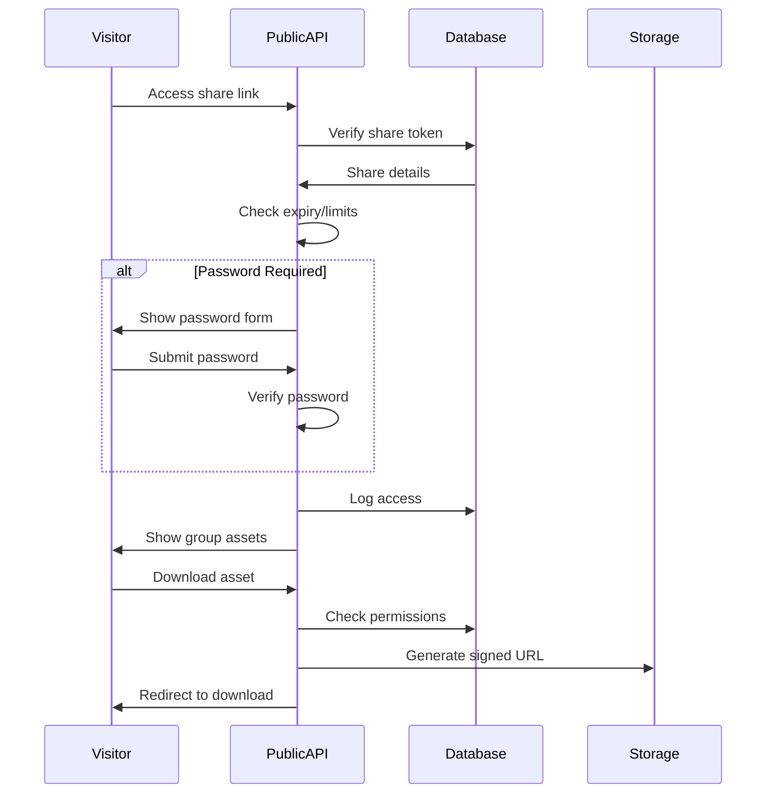

# Asset Group Management System

## Overview
The Asset Group Management System allows users to create collections of assets for organized distribution and sharing. Groups can contain assets from the main library and support various access control mechanisms including password protection (tier-dependent).

## Core Features

### Asset Groups
- Dynamic collections of assets
- Nested group support
- Custom metadata and descriptions
- Access control per group
- Shareable via links

### Sharing Capabilities
- Public/private groups
- Password protection (tier-dependent)
- Time-limited access
- Download permissions
- Analytics tracking

## API Endpoints

```typescript
// Group Management
GET    /api/groups                          // List groups
GET    /api/groups/:id                      // Get group details
POST   /api/groups                          // Create new group
PUT    /api/groups/:id                      // Update group
DELETE /api/groups/:id                      // Delete group

// Asset Management within Groups
GET    /api/groups/:id/assets               // List group assets
POST   /api/groups/:id/assets               // Add assets to group
DELETE /api/groups/:id/assets/:assetId      // Remove asset from group
POST   /api/groups/:id/assets/bulk          // Bulk add/remove

// Sharing
POST   /api/groups/:id/share                // Create share link
GET    /api/groups/:id/shares               // List share links
PUT    /api/groups/:id/shares/:shareId      // Update share settings
DELETE /api/groups/:id/shares/:shareId      // Revoke share link

// Public Access (no auth required)
GET    /api/public/groups/:shareToken       // Access shared group
POST   /api/public/groups/:shareToken/auth  // Password verification
GET    /api/public/groups/:shareToken/assets // List assets
GET    /api/public/groups/:shareToken/download/:assetId // Download asset
```

## Database Schema (Drizzle ORM)

```typescript
// asset_groups table
export const assetGroups = pgTable('asset_groups', {
  id: uuid('id').defaultRandom().primaryKey(),
  organizationId: uuid('organization_id').references(() => organizations.id).notNull(),
  createdBy: uuid('created_by').references(() => users.id).notNull(),
  
  // Group information
  name: varchar('name', { length: 255 }).notNull(),
  description: text('description'),
  coverImageId: uuid('cover_image_id').references(() => assets.id),
  
  // Hierarchy
  parentGroupId: uuid('parent_group_id').references(() => assetGroups.id),
  
  // Settings
  isPublic: boolean('is_public').default(false),
  requirePassword: boolean('require_password').default(false),
  passwordHash: varchar('password_hash', { length: 255 }),
  
  // Metadata
  metadata: jsonb('metadata').default({
    tags: [],
    customFields: {}
  }),
  
  // Timestamps
  createdAt: timestamp('created_at').defaultNow(),
  updatedAt: timestamp('updated_at').defaultNow(),
  deletedAt: timestamp('deleted_at') // Soft delete
});

// group_assets junction table
export const groupAssets = pgTable('group_assets', {
  groupId: uuid('group_id').references(() => assetGroups.id).notNull(),
  assetId: uuid('asset_id').references(() => assets.id).notNull(),
  
  // Order within group
  sortOrder: integer('sort_order').default(0),
  
  // Asset-specific settings in group
  customTitle: varchar('custom_title', { length: 255 }),
  customDescription: text('custom_description'),
  
  addedBy: uuid('added_by').references(() => users.id).notNull(),
  addedAt: timestamp('added_at').defaultNow()
}, (table) => {
  return {
    pk: primaryKey(table.groupId, table.assetId)
  }
});

// group_shares table
export const groupShares = pgTable('group_shares', {
  id: uuid('id').defaultRandom().primaryKey(),
  groupId: uuid('group_id').references(() => assetGroups.id).notNull(),
  createdBy: uuid('created_by').references(() => users.id).notNull(),
  
  // Share settings
  shareToken: varchar('share_token', { length: 255 }).unique().notNull(),
  name: varchar('name', { length: 255 }), // Internal name for tracking
  
  // Access control
  requirePassword: boolean('require_password').default(false),
  passwordHash: varchar('password_hash', { length: 255 }),
  
  // Permissions
  allowDownload: boolean('allow_download').default(true),
  allowViewMetadata: boolean('allow_view_metadata').default(true),
  
  // Time limits
  expiresAt: timestamp('expires_at'),
  maxViews: integer('max_views'),
  maxDownloads: integer('max_downloads'),
  
  // Usage tracking
  viewCount: integer('view_count').default(0),
  downloadCount: integer('download_count').default(0),
  lastAccessedAt: timestamp('last_accessed_at'),
  
  // Status
  isActive: boolean('is_active').default(true),
  
  createdAt: timestamp('created_at').defaultNow()
});

// group_permissions table
export const groupPermissions = pgTable('group_permissions', {
  id: uuid('id').defaultRandom().primaryKey(),
  groupId: uuid('group_id').references(() => assetGroups.id).notNull(),
  
  // Can be role-based or user-specific
  roleId: uuid('role_id').references(() => roles.id),
  userId: uuid('user_id').references(() => users.id),
  
  // Permissions
  canView: boolean('can_view').default(true),
  canEdit: boolean('can_edit').default(false),
  canDelete: boolean('can_delete').default(false),
  canShare: boolean('can_share').default(false),
  canManageAssets: boolean('can_manage_assets').default(false),
  
  grantedBy: uuid('granted_by').references(() => users.id),
  grantedAt: timestamp('granted_at').defaultNow()
});

// share_access_logs table
export const shareAccessLogs = pgTable('share_access_logs', {
  id: uuid('id').defaultRandom().primaryKey(),
  shareId: uuid('share_id').references(() => groupShares.id).notNull(),
  
  // Access details
  action: varchar('action', { length: 50 }).notNull(), // 'view', 'download', 'password_attempt'
  assetId: uuid('asset_id').references(() => assets.id),
  
  // Visitor info
  ipAddress: varchar('ip_address', { length: 45 }),
  userAgent: text('user_agent'),
  referer: text('referer'),
  
  // Additional data
  metadata: jsonb('metadata').default({}),
  success: boolean('success').default(true),
  
  createdAt: timestamp('created_at').defaultNow()
});
```

## Group Features by Tier

### Feature Matrix
```typescript
interface GroupFeaturesByTier {
  basic: {
    maxGroups: 10,
    maxAssetsPerGroup: 100,
    allowNesting: false,
    allowPasswordProtection: false,
    allowCustomSharing: false,
    shareExpiry: '7d',
    analytics: 'basic'
  },
  pro: {
    maxGroups: 100,
    maxAssetsPerGroup: 1000,
    allowNesting: true,
    allowPasswordProtection: true,
    allowCustomSharing: true,
    shareExpiry: '30d',
    analytics: 'advanced'
  },
  enterprise: {
    maxGroups: -1, // Unlimited
    maxAssetsPerGroup: -1,
    allowNesting: true,
    allowPasswordProtection: true,
    allowCustomSharing: true,
    shareExpiry: 'custom',
    analytics: 'full',
    customBranding: true,
    whiteLabeling: true
  }
}
```

## Sharing System

### Share Link Generation
```typescript
async function createShareLink(groupId: string, options: ShareOptions) {
  // Check tier permissions
  const org = await getOrganizationFromGroup(groupId);
  const tierFeatures = await getTierFeatures(org.tierId);
  
  if (options.requirePassword && !tierFeatures.allowPasswordProtection) {
    throw new TierFeatureError('Password protection not available in current tier');
  }
  
  // Generate unique token
  const shareToken = generateSecureToken();
  
  // Create share record
  const share = await createGroupShare({
    groupId,
    shareToken,
    ...options,
    passwordHash: options.password ? await hashPassword(options.password) : null
  });
  
  return {
    shareUrl: `${BASE_URL}/share/${shareToken}`,
    shareToken,
    expiresAt: share.expiresAt
  };
}
```

### Public Access Flow


## Group Organization

### Hierarchical Structure
```typescript
interface GroupHierarchy {
  id: string;
  name: string;
  children: GroupHierarchy[];
  assetCount: number;
  totalAssetCount: number; // Including children
}

// Build hierarchy
async function buildGroupHierarchy(orgId: string): Promise<GroupHierarchy[]> {
  const groups = await getOrganizationGroups(orgId);
  return buildTree(groups, null);
}
```

### Asset Organization
```typescript
// Custom sorting and organization within groups
interface GroupAssetOrganization {
  sections: Array<{
    name: string;
    assets: string[]; // Asset IDs
  }>;
  defaultSort: 'name' | 'date' | 'type' | 'custom';
  layout: 'grid' | 'list' | 'gallery';
}
```

## Analytics & Reporting

### Group Analytics
```typescript
interface GroupAnalytics {
  groupId: string;
  period: 'day' | 'week' | 'month' | 'year';
  metrics: {
    totalViews: number;
    uniqueVisitors: number;
    totalDownloads: number;
    popularAssets: Array<{
      assetId: string;
      views: number;
      downloads: number;
    }>;
    geographicData: Record<string, number>; // Country -> count
    deviceTypes: Record<string, number>;
    sharePerformance: Array<{
      shareId: string;
      views: number;
      downloads: number;
    }>;
  };
}
```

### Reporting Features
- Scheduled reports (enterprise tier)
- Export to CSV/PDF
- Custom date ranges

## Security & Access Control

### Permission Inheritance
```typescript
// Groups inherit base permissions from organization
// Can be overridden at group level
async function getEffectivePermissions(
  userId: string, 
  groupId: string
): Promise<GroupPermissions> {
  // Check user's organization role
  const orgRole = await getUserOrganizationRole(userId, groupId);
  
  // Check group-specific permissions
  const groupPerms = await getGroupPermissions(userId, groupId);
  
  // Merge with role defaults
  return mergePermissions(orgRole.permissions, groupPerms);
}
```

### Share Security
- Token rotation for long-lived shares
- IP-based restrictions (enterprise)
- Watermarking for downloaded assets (enterprise)
- Audit trail for all access

## Performance Optimization

### Caching Strategy
```typescript
// Cache frequently accessed groups
const GROUP_CACHE_TTL = 300; // 5 minutes

async function getCachedGroup(groupId: string) {
  const cacheKey = `group:${groupId}`;
  const cached = await redis.get(cacheKey);
  
  if (cached) return JSON.parse(cached);
  
  const group = await getGroupWithAssets(groupId);
  await redis.setex(cacheKey, GROUP_CACHE_TTL, JSON.stringify(group));
  
  return group;
}
```

### Database Optimization
```sql
-- Indexes for performance
CREATE INDEX idx_group_assets_group_id ON group_assets(group_id);
CREATE INDEX idx_group_assets_asset_id ON group_assets(asset_id);
CREATE INDEX idx_group_shares_token ON group_shares(share_token);
CREATE INDEX idx_share_access_logs_share_id ON share_access_logs(share_id);
CREATE INDEX idx_asset_groups_org_id ON asset_groups(organization_id);
CREATE INDEX idx_asset_groups_parent_id ON asset_groups(parent_group_id);
```

## Integration Points

### Webhooks (Enterprise)
```typescript
// Notify external systems of group events
interface GroupWebhookEvents {
  'group.created': { groupId: string; name: string };
  'group.updated': { groupId: string; changes: string[] };
  'group.deleted': { groupId: string };
  'share.created': { groupId: string; shareId: string };
  'share.accessed': { shareId: string; assetId?: string };
  'share.expired': { shareId: string };
}
```

### API Access (Pro/Enterprise)
- RESTful API for group management
- Bulk operations support
- Programmatic share creation
- Analytics API endpoints