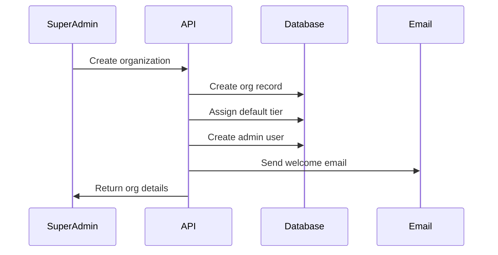
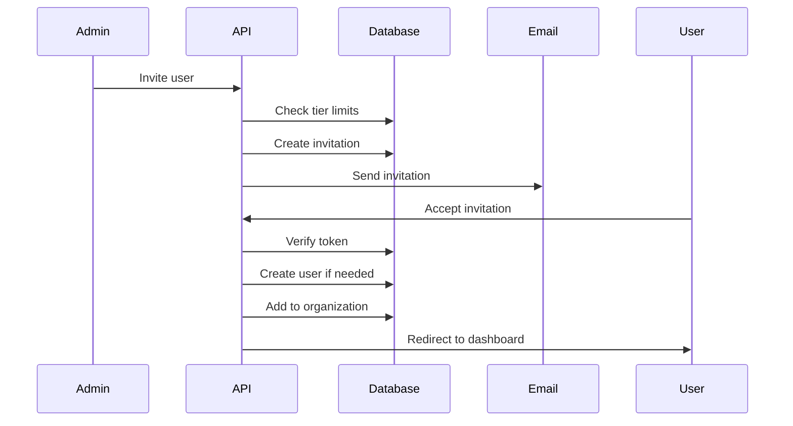

# Organization & User Management System

## Overview
The Organization Management System provides multi-tenancy support, user management, and tier-based feature control. It handles organization creation, user invitations, role assignments, and usage tracking.

## Core Concepts

### Organizations
- Independent workspaces with isolated data
- Tier-based feature access
- Custom branding options
- Usage metrics and billing

### Users
- Belong to one or more organizations
- Role-based permissions within each organization
- SSO or credentials authentication
- Activity tracking

## API Endpoints

```typescript
// Organization Management
GET    /api/organizations                    // List user's organizations
GET    /api/organizations/:id                // Get organization details
POST   /api/organizations                    // Create new organization (super admin)
PUT    /api/organizations/:id                // Update organization settings
DELETE /api/organizations/:id                // Delete organization (super admin)

// Organization Settings
GET    /api/organizations/:id/settings       // Get all settings
PUT    /api/organizations/:id/settings       // Update settings
PUT    /api/organizations/:id/branding       // Update branding

// User Management within Organization
GET    /api/organizations/:id/users          // List organization users
POST   /api/organizations/:id/users/invite   // Invite user
DELETE /api/organizations/:id/users/:userId  // Remove user
PUT    /api/organizations/:id/users/:userId/role // Update user role

// Usage & Metrics
GET    /api/organizations/:id/usage          // Current usage stats
GET    /api/organizations/:id/usage/history  // Historical usage
GET    /api/organizations/:id/activity       // Activity log

// Tier Management
GET    /api/organizations/:id/tier           // Get current tier info
PUT    /api/organizations/:id/tier           // Change tier (super admin)
GET    /api/organizations/:id/tier/limits    // Get tier limits
```

## Database Schema (Drizzle ORM)

```typescript
// organizations table
export const organizations = pgTable('organizations', {
  id: uuid('id').defaultRandom().primaryKey(),
  name: varchar('name', { length: 255 }).notNull(),
  slug: varchar('slug', { length: 255 }).unique().notNull(),
  
  // Tier information
  tierId: uuid('tier_id').references(() => tiers.id).notNull(),
  tierOverrides: jsonb('tier_overrides').default({}), // Custom limits
  
  // Branding
  logoUrl: varchar('logo_url', { length: 500 }),
  primaryColor: varchar('primary_color', { length: 7 }),
  secondaryColor: varchar('secondary_color', { length: 7 }),
  customDomain: varchar('custom_domain', { length: 255 }),
  
  // Settings
  settings: jsonb('settings').default({
    allowPublicSharing: true,
    requireMfa: false,
    allowedDomains: [],
    defaultUserRole: 'user'
  }),
  
  // Metadata
  createdAt: timestamp('created_at').defaultNow(),
  updatedAt: timestamp('updated_at').defaultNow(),
  deletedAt: timestamp('deleted_at'), // Soft delete
  createdBy: uuid('created_by').references(() => users.id)
});

// tiers table
export const tiers = pgTable('tiers', {
  id: uuid('id').defaultRandom().primaryKey(),
  name: varchar('name', { length: 50 }).unique().notNull(),
  displayName: varchar('display_name', { length: 100 }).notNull(),
  
  // System limits
  limits: jsonb('limits').notNull().default({
    maxUsers: 10,
    maxAssets: 1000,
    maxStorageGB: 10,
    maxFileSizeMB: 100,
    maxAssetGroups: 50
  }),
  
  // Feature flags
  features: jsonb('features').notNull().default({
    customS3: false,
    passwordProtectedSharing: false,
    colorPalettes: false,
    fontManagement: false,
    advancedAnalytics: false,
    apiAccess: false,
    customBranding: false,
    ssoIntegration: false
  }),
  
  // Pricing (for reference)
  monthlyPriceUSD: decimal('monthly_price_usd', { precision: 10, scale: 2 }),
  
  isActive: boolean('is_active').default(true),
  createdAt: timestamp('created_at').defaultNow()
});

// organization_users junction table
export const organizationUsers = pgTable('organization_users', {
  organizationId: uuid('organization_id').references(() => organizations.id).notNull(),
  userId: uuid('user_id').references(() => users.id).notNull(),
  roleId: uuid('role_id').references(() => roles.id).notNull(),
  
  invitedBy: uuid('invited_by').references(() => users.id),
  invitedAt: timestamp('invited_at'),
  joinedAt: timestamp('joined_at').defaultNow(),
  lastActiveAt: timestamp('last_active_at'),
  
  isActive: boolean('is_active').default(true)
}, (table) => {
  return {
    pk: primaryKey(table.organizationId, table.userId)
  }
});

// organization_invitations table
export const organizationInvitations = pgTable('organization_invitations', {
  id: uuid('id').defaultRandom().primaryKey(),
  organizationId: uuid('organization_id').references(() => organizations.id).notNull(),
  email: varchar('email', { length: 255 }).notNull(),
  roleId: uuid('role_id').references(() => roles.id).notNull(),
  
  token: varchar('token', { length: 255 }).unique().notNull(),
  invitedBy: uuid('invited_by').references(() => users.id).notNull(),
  
  expiresAt: timestamp('expires_at').notNull(),
  acceptedAt: timestamp('accepted_at'),
  
  createdAt: timestamp('created_at').defaultNow()
});

// usage_metrics table
export const usageMetrics = pgTable('usage_metrics', {
  id: uuid('id').defaultRandom().primaryKey(),
  organizationId: uuid('organization_id').references(() => organizations.id).notNull(),
  
  // Current usage
  totalAssets: integer('total_assets').default(0),
  totalStorageBytes: bigint('total_storage_bytes', { mode: 'number' }).default(0),
  totalUsers: integer('total_users').default(0),
  totalAssetGroups: integer('total_asset_groups').default(0),
  
  // Monthly metrics
  monthlyDownloads: integer('monthly_downloads').default(0),
  monthlyUploads: integer('monthly_uploads').default(0),
  monthlyActiveUsers: integer('monthly_active_users').default(0),
  
  // Timestamps
  calculatedAt: timestamp('calculated_at').defaultNow(),
  month: varchar('month', { length: 7 }) // YYYY-MM format
});
```

## Organization Lifecycle

### Creation Flow


### User Invitation Flow


## Tier Management

### Tier Configuration
```typescript
interface TierConfig {
  // System limits
  limits: {
    maxUsers: number;
    maxAssets: number;
    maxStorageGB: number;
    maxFileSizeMB: number;
    maxAssetGroups: number;
    maxColorPalettes?: number;
    maxFontFamilies?: number;
  };
  
  // Feature flags
  features: {
    customS3: boolean;
    passwordProtectedSharing: boolean;
    colorPalettes: boolean;
    fontManagement: boolean;
    advancedAnalytics: boolean;
    apiAccess: boolean;
    customBranding: boolean;
    ssoIntegration: boolean;
    watermarking?: boolean;
    bulkOperations?: boolean;
  };
}
```

### Usage Enforcement
```typescript
// Middleware to check limits before operations
export async function enforceOrgLimits(
  orgId: string, 
  operation: 'addUser' | 'uploadAsset' | 'createGroup'
) {
  const org = await getOrganization(orgId);
  const usage = await getUsageMetrics(orgId);
  const limits = await getTierLimits(org.tierId);
  
  switch (operation) {
    case 'addUser':
      if (usage.totalUsers >= limits.maxUsers) {
        throw new TierLimitError('User limit reached');
      }
      break;
    case 'uploadAsset':
      if (usage.totalAssets >= limits.maxAssets) {
        throw new TierLimitError('Asset limit reached');
      }
      break;
    case 'createGroup':
      if (usage.totalAssetGroups >= limits.maxAssetGroups) {
        throw new TierLimitError('Asset group limit reached');
      }
      break;
  }
}
```

## Organization Settings

### Available Settings
```typescript
interface OrganizationSettings {
  // Security
  allowPublicSharing: boolean;
  requireMfa: boolean;
  allowedDomains: string[]; // Email domains for auto-join
  ipWhitelist?: string[];
  
  // Defaults
  defaultUserRole: 'user' | 'content_manager';
  defaultAssetVisibility: 'organization' | 'private';
  
  // Features
  enableWatermark: boolean;
  watermarkText?: string;
  enableVersioning: boolean;
  retentionDays?: number; // Auto-delete after N days
  
  // Notifications
  notificationEmail?: string;
  weeklyReports: boolean;
  usageAlerts: boolean;
}
```

## Activity Logging

### Tracked Events
```typescript
// activity_logs table
export const activityLogs = pgTable('activity_logs', {
  id: uuid('id').defaultRandom().primaryKey(),
  organizationId: uuid('organization_id').references(() => organizations.id).notNull(),
  userId: uuid('user_id').references(() => users.id).notNull(),
  
  action: varchar('action', { length: 50 }).notNull(),
  entityType: varchar('entity_type', { length: 50 }),
  entityId: uuid('entity_id'),
  
  metadata: jsonb('metadata').default({}),
  ipAddress: varchar('ip_address', { length: 45 }),
  userAgent: text('user_agent'),
  
  createdAt: timestamp('created_at').defaultNow()
});

// Tracked actions
enum ActivityAction {
  // Auth
  USER_LOGIN = 'user_login',
  USER_LOGOUT = 'user_logout',
  
  // Assets
  ASSET_UPLOAD = 'asset_upload',
  ASSET_DOWNLOAD = 'asset_download',
  ASSET_DELETE = 'asset_delete',
  ASSET_SHARE = 'asset_share',
  
  // Organization
  USER_INVITE = 'user_invite',
  USER_REMOVE = 'user_remove',
  SETTINGS_UPDATE = 'settings_update',
  TIER_CHANGE = 'tier_change'
}
```

## Super Admin Features

### Cross-Organization Management
```typescript
// Super admin can:
- View all organizations
- Access any organization's data
- Change organization tiers
- Override tier limits
- Impersonate users
- Generate platform reports
- Manage tier definitions
```

### Platform Analytics
```typescript
interface PlatformAnalytics {
  totalOrganizations: number;
  organizationsByTier: Record<string, number>;
  totalUsers: number;
  totalAssets: number;
  totalStorageUsedGB: number;
  monthlyActiveOrgs: number;
  revenueByTier: Record<string, number>;
  growthMetrics: {
    newOrgsThisMonth: number;
    churnedOrgsThisMonth: number;
    upgradedOrgsThisMonth: number;
  };
}
```

## Security Considerations

### Data Isolation
- Strict organization-based data filtering
- Row-level security in database
- Separate storage paths per organization
- No cross-organization data access

### Audit Trail
- All administrative actions logged
- Immutable audit records
- Compliance reporting capabilities
- Data retention policies

## Performance Optimization

### Caching Strategy
- Organization settings cached in Redis
- User permissions cached per session
- Usage metrics updated asynchronously
- Tier limits cached globally

### Database Indexes
```sql
-- Performance indexes
CREATE INDEX idx_org_users_org_id ON organization_users(organization_id);
CREATE INDEX idx_org_users_user_id ON organization_users(user_id);
CREATE INDEX idx_activity_logs_org_id ON activity_logs(organization_id);
CREATE INDEX idx_activity_logs_created_at ON activity_logs(created_at);
CREATE INDEX idx_usage_metrics_org_id ON usage_metrics(organization_id);
```